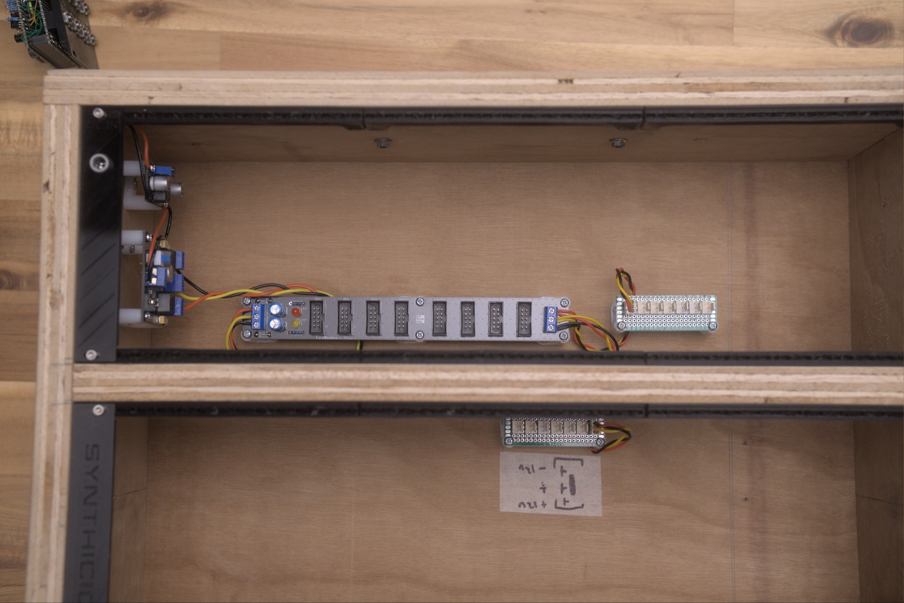

# EuroBusboard



A Eurorack bus board with **8 module slots**, distributing **±12V + GND** across multiple connector formats. The project has three PCB variants in the same KiCad project: **10-pin IDC + JST combined**, **10-pin IDC only**, and **JST only**.

> For the Doepfer-standard 16-pin IDC variant (with `+5V`, `CV`, `Gate` rails additionally distributed), see the sibling repo: **[EuroBusboard-8-IDC-16PIN](https://github.com/DIYSynthMNL/EuroBusboard-8-IDC-16PIN)**.

## Variants

The KiCad project contains four configurations. Pick one when fabricating the PCB:

| Variant | KiCad file | Per-slot connectors | Use case |
|---|---|---|---|
| **16-pin IDC** (Doepfer A-100) | (in separate repo: [EuroBusboard-8-IDC-16PIN](https://github.com/DIYSynthMNL/EuroBusboard-8-IDC-16PIN)) | 1× 16-pin IDC | Modules with full Doepfer ribbon cables (±12V + GND + +5V + CV + Gate) |
| **10-pin IDC + JST (combined)** | `eurobusboard_idc_jst_8.kicad_pcb` | 1× 10-pin IDC + 1× 3-pin JST | Maximum flexibility — accepts both connector types per slot |
| **10-pin IDC only** | `eurobusboard_idc_8.kicad_pcb` | 1× 10-pin IDC | Compact, IDC-only modules |
| **JST only** | `eurobusboard_jst_8.kicad_pcb` | 1× 3-pin JST | DIY modules that use only the 3-pin JST power input |

All variants share the same power-input + reverse-protection + filter section. Only the per-slot connectors differ.

## Pinout (10-pin IDC, Eurorack subset of Doepfer A-100)

Looking at the IDC connector with the keyway (red stripe) on the *bottom*:

```
Pin   10  9   8   7   6   5   4   3   2   1
      +12 +12 GND GND GND GND GND GND -12 -12
```

`-12V` is on pin 1 / 2 (the red-stripe side) — Eurorack convention. `+12V` is on pin 9 / 10 (opposite side). Six GND pins in the middle provide low-impedance ground return.

The **3-pin JST** is:

| JST pin | Net |
|---|---|
| 1 | +12V |
| 2 | GND |
| 3 | -12V |

## Schematic

- Latest: **Rev 0.1** ([EuroBusboard-Schematic-rev0.1.pdf](Schematic%20PDFs/EuroBusboard-Schematic-rev0.1.pdf)) — 3 sheets, one per non-16-pin variant

## Power input / protection

Same circuit on all three sheets, just renamed nets per variant:

```
External ±12V supply
   │
   ├──[D3 / D14 / D9   1N4007 reverse-polarity diode on +12V]──┬── +12V bus
   │                                                            │
   │                                                            [C1 / C7 / C5   100µF bulk cap]
   │                                                            │
   │                                                            [D1 / D13 / D11  +12V indicator LED + R1/R7/R5 10K]
   │
   └──[D4 / D16 / D10  1N4007 reverse-polarity diode on -12V]──┬── -12V bus
                                                                │
                                                                [C2 / C8 / C6   100µF bulk cap]
                                                                │
                                                                [D2 / D15 / D12  -12V indicator LED + R2/R8/R6 10K]
```

Additional features (combined-variant only):
- **Power Thru** (J20, J21) — daisy-chain to another bus board
- **Test points** TP1 (+12V), TP2 (GND), TP3 (-12V) for DMM probing

## Design notes

**1N4007 diodes have a real voltage drop.** At a peak transient current of 1 A across each rail (with all 8 modules pulling momentarily), the diode drops about **1.0 V** — modules see only ~11 V on the rail instead of 12 V. For most analog modules this is harmless; for tight regulators (e.g. an LM7805 regulating to +5V from +12V supply that's actually 11V), it can reduce headroom. **A 1N5817 Schottky (~0.4 V drop)** would be a near-drop-in upgrade. See [issue](../../issues).

**No +5V or CV/Gate rails.** The 10-pin IDC variants don't distribute +5V (which most digital modules need) or CV/Gate (which the Doepfer A-100 standard provides for keyboard-bus signals). Modules requiring +5V must generate their own (via a 78M05 + the +12V rail — which is what most DIYSynthMNL modules do). For full Doepfer compatibility, use the 16-pin IDC variant in [EuroBusboard-8-IDC-16PIN](https://github.com/DIYSynthMNL/EuroBusboard-8-IDC-16PIN).

**Bulk capacitance.** 100 µF at the input is reasonable for a small case. For a fully-loaded board with current-hungry modules (digital sequencers, OLEDs, several VCAs), consider adding ~10 µF ceramics near each IDC connector for transient suppression.

## License

[GPLv3](LICENSE) — strong copyleft. **Note:** this is different from most DIYSynthMNL modules (which use CC-BY-NC-SA 4.0 for hardware, MIT for firmware). Confirm this license is intentional — for a passive bus board, MIT or CC-BY-SA may be more appropriate. See [issue](../../issues).

## Build status

What's ready for builders today, and what's still on the TODO list:

- [x] Schematic — Rev 0.1 ([EuroBusboard-Schematic-rev0.1.pdf](Schematic%20PDFs/EuroBusboard-Schematic-rev0.1.pdf))
- [ ] PCB layout — in progress — four variants in `kicad/`, no rev marker yet
- [ ] Gerber files for fabrication — none yet
- [ ] BOM — bus boards are simple; the schematic doubles as the BOM (LED color, diode replacement to Schottky if you take the recommendation above, etc.)
- [x] Photos of an assembled board — see [photos/](photos/)
- [x] License — [LICENSE](LICENSE) (GPLv3 — see note above)
